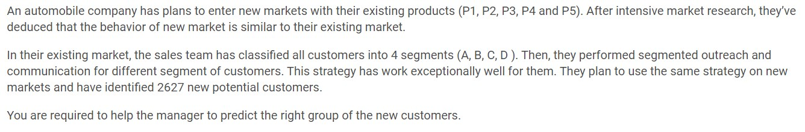
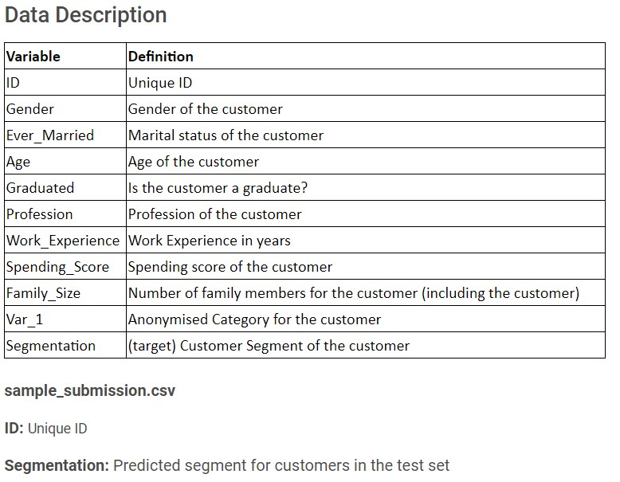
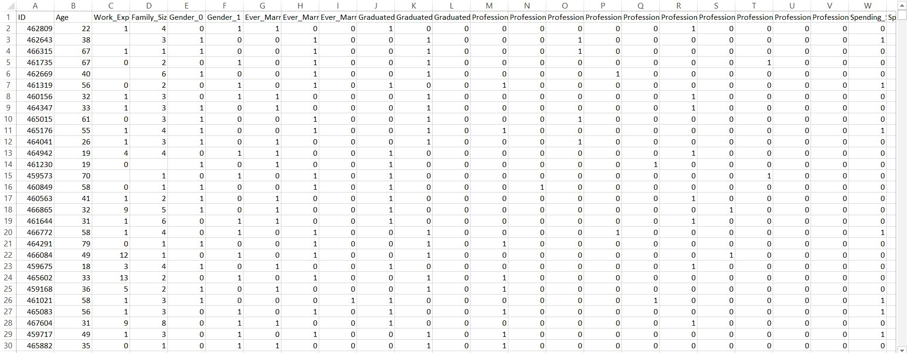
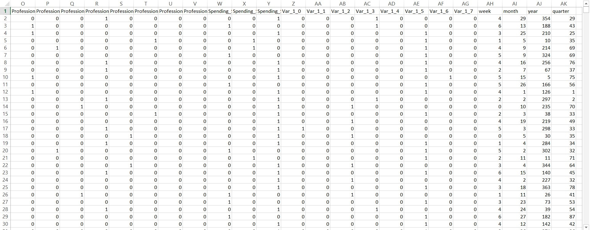

# Analytics Vidhya Jantahack Healthcare Analytics

Public Leaderboard Rank: 86
 
Private Leaderboard Rank: 89

## Problem Statement

## Data Description at a Glance:

## Data after Merging and Feature Engineering:

## Description of Approach/Feature Engineering:
1. Merged train dataset and test dataset to form a merged dataset
2. Label Encoded the categorical columns
3. Added dummy columns
4. Split the merged dataset to train and test dataset
5. Applied LGBMClassifier with the previously tested parameters and fitted it
6. Created the final.csv with the prediction of the LGBMClassifier model

## Tools used
1. Python
2. pandas and numpy libraries for data manipulation
3. LGBMClassifier for prediction

## Score
The score obtained using this solution is **0.9352380952**

## Competition Result
[Rank](https://datahack.analyticsvidhya.com/contest/janatahack-healthcare-analytics/#LeaderBoard): 86th on public LB and 89th on private LB
